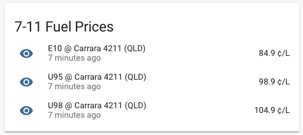
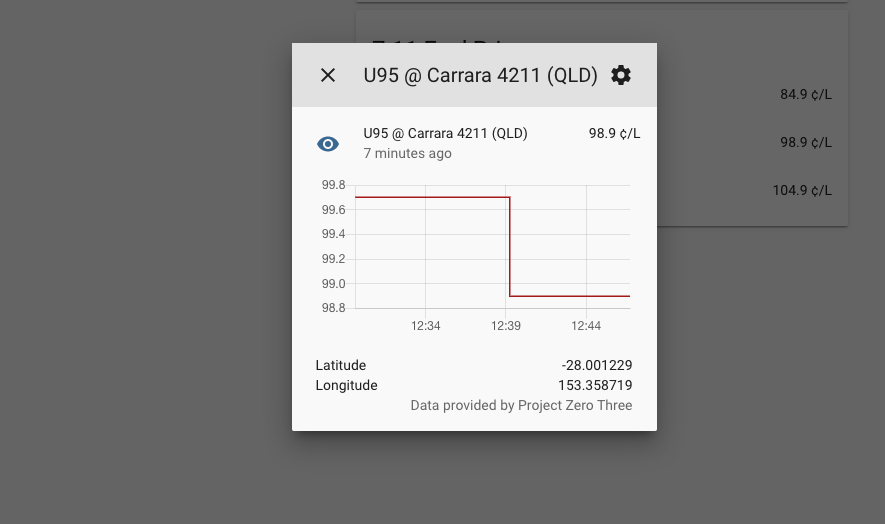

# Project Three Zero (7-11 Fuel Lock) for Home Assistant

A simple component for home assistant to display the cheapest prices around australia for your helicopter journeys :)

## Using the component

1) Install [HACS](https://hacs.xyz/docs/installation/manual) if you haven't already
2) Head over to the `HACS` tab, and click on the "Custom Repositories" menu icon.
3) Enter the URL `https://github.com/atymic/project_three_zero_ha` and `Integration" for the category and hit save.
4) Restart HA
4) Check the entity list, you should see them populated (named `project_three_zero_<fuelcode>`)